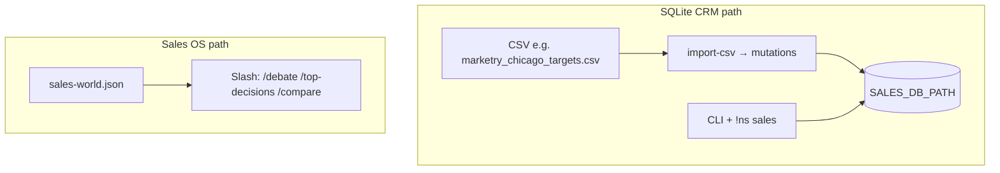

# Developer onboarding — NightShift sales

> **NightShift Sales** = **(CRM = truth)** + **(Sales OS = reasoning)** with explicit, opt-in synchronization.

**Single map** for how sales works in this repo. Root overview: [README.md](../README.md).

**Architecture in one idea:** the system **separates truth from thinking** — imported, auditable **data** (SQLite CRM) from **ranking, debate, and decision surfaces** (world JSON / Sales OS). They are wired through the same app and Discord bot, but **not implicitly the same datastore** until you opt in (see [CRM_SALES_OS_UNIFICATION.md](./CRM_SALES_OS_UNIFICATION.md)).

---

## Core mental model (read this first)

**NightShift has two sales systems today.** They share the same Node process and Discord bot, but **not the same default datastore** for “what `/debate` sees.”


| Layer                         | Data                                    | Role                                                                                                                  |
| ----------------------------- | --------------------------------------- | --------------------------------------------------------------------------------------------------------------------- |
| **SQLite CRM**                | `SALES_DB_PATH`                         | **Source of truth for accounts, contacts, mutations** — seeded by CSV import + apply pipeline.                        |
| **Sales OS (decision layer)** | `SALES_WORLD_JSON` → `loadSalesWorld()` | **Reasoning surface** — `top-decisions`, Pair Debate, dossiers — **deal-centric JSON**, not your CSV unless you sync. |


**Translation:**

- **CRM** = real imported company/contact data (auditable, mutation-based).
- **Sales OS** = which deal to think about next + debate/rank outputs.
- **They are not automatically synced.** Unification is a **planned integration**; see [CRM_SALES_OS_UNIFICATION.md](./CRM_SALES_OS_UNIFICATION.md).

---

## When to use what

| Use case | System | How |
|----------|--------|-----|
| Import / manage companies and contacts | **CRM** | `import-csv`, `apply-pending`, `!ns sales`, SQLite |
| Evaluate / rank which deal matters now | **Sales OS** | `top-decisions`, world file or future CRM-backed source |
| Run Pair Debate / compare models | **Sales OS** | `pair-debate`, `--world`, slash `/debate` |
| Send / track actions, mutations, audit trail | **CRM** + execution docs | `SalesAction`, policy, CRM pipeline |
| Demos, CI, offline eval, fixtures | **World JSON** | `examples/sales-world.sample.json`, `validate-sales-world-shape` |

---

### Diagram (mental model)




There is **no** edge between CRM and Sales OS above: **no automatic sync** (see [CRM_SALES_OS_UNIFICATION.md](./CRM_SALES_OS_UNIFICATION.md)).

Same app, two surfaces — **do not assume** one feed drives the other.

---

## Common mistakes (what breaks if misused)

| Wrong assumption | What actually happens |
|--------------------|------------------------|
| “`/debate` uses my CRM import” | Debate loads **`SalesWorldFile`** deals. CRM rows are **invisible** unless exported to world shape or Phase 2 read-through. |
| “The CSV feeds `/top-decisions`” | **`top-decisions`** ranks from **world JSON** (or future CRM source), not directly from the CSV. |
| “I’ll debug slash by querying SQLite” | For **slash**, check **`SALES_WORLD_JSON`** / `--world` and deal ids first. For **CRM**, use **`!ns sales status`** / DB. |
| “One source of truth everywhere” | **Not yet.** CRM is truth for **accounts**; world file defines **which deals the engine sees** until unified. |

If something looks wrong: **pick the layer** — CRM vs Sales OS — then debug that layer only.

---

## Debugging guide

Follow this order so confusion becomes a **deterministic** path:

1. **Data about companies/contacts/deals looks wrong** → **SQLite CRM**: import path, mutations, `apply-pending`, `SALES_DB_PATH`, [`companies-pipeline-format.md`](./companies-pipeline-format.md).
2. **Rankings, debate output, or dossier content looks wrong** → **`SALES_WORLD_JSON`** or whatever you passed as **`--world`** — not the CSV file by default.
3. **Discord behavior surprises you** → Which **command path**? **Prefix `!ns sales`** = CRM pipeline · **Slash `/…`** = Sales OS (world-backed today). See [DISCORD_SETUP.md](../DISCORD_SETUP.md).
4. **CRM and “what `/debate` sees” disagree** → **Expected** until you **export** (`crm-export-world`, Phase 1) or use **explicit `--source`** (Phase 2). The systems are **not auto-synced**.

**If a mismatch exists between CRM and decision UX, assume “not synced” first** — then re-export or follow [CRM_SALES_OS_UNIFICATION.md](./CRM_SALES_OS_UNIFICATION.md).

---

## First 10 minutes (do this)

```bash
cd /path/to/autocoder   # this repo
npm install
npm run build
```

**1 — Seed CRM (SQLite)**

```bash
export SALES_DB_PATH="$PWD/state/sales.db"
node dist/index.js sales import-csv examples/marketry_chicago_targets.csv
node dist/index.js sales apply-pending you
```

**2 — Decision stack (separate data: world file)**

Ensure `state/sales-world.json` exists (e.g. `npm run rollout:seed-world`), then:

```bash
node dist/index.js sales top-decisions --limit 10 --world examples/sales-world.sample.json
# Pair Debate uses a deal id from that world, e.g.:
node dist/index.js sales pair-debate --deal acme-expansion-2026 --world examples/sales-world.sample.json
```

**3 — Validate canonical CSV (CI contract)**

```bash
npm run validate:marketry-csv
```

**4 — Optional: Discord**

- Env: [DISCORD_SETUP.md](../DISCORD_SETUP.md)
- `npm run daemon`
- **`!ns sales`** → CRM path · **Slash** (`/debate`, …) → Sales OS path

**5 — Full local CI**

```bash
npm run ci
```

---

## Documentation map


| Topic | Doc | Purpose |
|-------|-----|---------|
| Core daemon | [README.md](../README.md) | NightShift engine, `!ns`, safety, deferred items |
| Sales stack (phases 1–8) | [PR_SALES_PHASES_1_8.md](./PR_SALES_PHASES_1_8.md) | Full sales architecture map |
| CRM pipeline | [companies-pipeline-format.md](./companies-pipeline-format.md) | CSV → SQLite, `pipeline.raw` |
| Marketry dataset + enums | [agents/CRM_MARKETRY_DATASET.md](./agents/CRM_MARKETRY_DATASET.md) | Canonical seed CSV |
| CRM ↔ Sales OS unification | [CRM_SALES_OS_UNIFICATION.md](./CRM_SALES_OS_UNIFICATION.md) | How the two layers converge |
| Sales OS rollout | [sales-os-rollout.md](./sales-os-rollout.md) | World JSON + Discord slash |
| Decision engine | [sales-decision-engine.md](./sales-decision-engine.md) | Ranking, triggers |
| Execution / policy | [sales-execution.md](./sales-execution.md) | `SalesAction`, approvals |
| Learning | [sales-intelligence.md](./sales-intelligence.md) | Outcomes → strategy |
| Discord | [DISCORD_SETUP.md](../DISCORD_SETUP.md) | Bot, intents, slash vs prefix |
| Smoke (live guild) | [discord-sales-os-smoke-checklist.md](./discord-sales-os-smoke-checklist.md) | Extended checks |


---

## Two sales surfaces (product boundary)


| Surface            | Data source        | Entry points                                      |
| ------------------ | ------------------ | ------------------------------------------------- |
| **SQLite CRM**     | `SALES_DB_PATH`    | CLI `nightshift sales …`; Discord **`!ns sales`** |
| **Slash Sales OS** | `loadSalesWorld()` | `/sales`, `/debate`, `/top-decisions`, `/compare` |


They are **intentionally separate** until unification work lands.

---

## Canonical dataset

- **File:** [examples/marketry_chicago_targets.csv](../examples/marketry_chicago_targets.csv)
- **Check:** `npm run validate:marketry-csv` (header order + 44 rows; also runs in `npm run ci`)

---

## What this system actually does

**CRM layer**

- Stores companies, contacts, deals (SQLite), mutation audit trail.
- Seeded via CSV (and other adapters); review-gated apply.

**Sales OS layer**

- Ranks deals, runs Pair Debate, compares models, surfaces `SalesAction` drafts — against **`SalesWorldFile`** today.

**Future direction** (not default today)

- **Phase 1:** `crm-export-world` (export-first). **Then** read-through CRM, then automation — mandatory order, deterministic `auto`, Phase 1 checklist: [CRM_SALES_OS_UNIFICATION.md](./CRM_SALES_OS_UNIFICATION.md) §17.

**Unification guardrails (do not violate):** no silent auto-sync; no slash → CRM writes; no implicit CRM → decision state — use **explicit export** or **`--source crm`** when implemented; keep auditability ([CRM_SALES_OS_UNIFICATION.md](./CRM_SALES_OS_UNIFICATION.md)).

### Next implementation step

Phase 1 **`crm-export-world`** is **specified** (checklist + field mappings + envelope) in [CRM_SALES_OS_UNIFICATION.md](./CRM_SALES_OS_UNIFICATION.md) §7 and §17 — implement that before read-through. No separate design doc required unless the team wants API sketches in code review.

