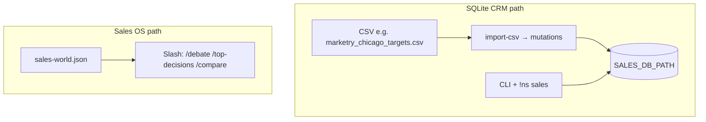

# Developer onboarding — NightShift sales

**Single map** for how sales works in this repo. Root overview: `[README.md](../README.md)`.

---

## Core mental model (read this first)

**NightShift has two sales systems today.** They share the same Node process and Discord bot, but **not the same default datastore** for “what `/debate` sees.”


| Layer                         | Data                                    | Role                                                                                                                  |
| ----------------------------- | --------------------------------------- | --------------------------------------------------------------------------------------------------------------------- |
| **SQLite CRM**                | `SALES_DB_PATH`                         | **Source of truth for accounts, contacts, mutations** — seeded by CSV import + apply pipeline.                        |
| **Sales OS (decision layer)** | `SALES_WORLD_JSON` → `loadSalesWorld()` | **Reasoning surface** — `top-decisions`, Pair Debate, dossiers — **deal-centric JSON**, not your CSV unless you sync. |


**Translation:**

- **CRM** = real imported company/contact data (auditable, mutation-based).
- **Sales OS** = which deal to think about next + debate/rank outputs.
- **They are not automatically synced.** Unification is a **planned integration**; see `[CRM_SALES_OS_UNIFICATION.md](./CRM_SALES_OS_UNIFICATION.md)`.

---

### Diagram (mental model)




There is **no** edge between CRM and Sales OS above: **no automatic sync** (see `[CRM_SALES_OS_UNIFICATION.md](./CRM_SALES_OS_UNIFICATION.md)`).

Same app, two surfaces — **do not assume** one feed drives the other.

---

## Common mistakes (what breaks if misused)


| Wrong assumption                         | What actually happens                                                                                                                     |
| ---------------------------------------- | ----------------------------------------------------------------------------------------------------------------------------------------- |
| “`/debate` uses my CRM import”           | Debate loads `**SalesWorldFile`** deals. CRM rows are **invisible** unless mirrored into the world file or a future adapter reads SQLite. |
| “The CSV feeds `/top-decisions`”         | `**top-decisions`** ranks deals from the **world JSON**, not from `marketry_chicago_targets.csv`.                                         |
| “I’ll debug slash — let me query SQLite” | For slash issues, check `**SALES_WORLD_JSON`** shape and deal ids first. For CRM issues, use `**!ns sales status**` / DB inspection.      |
| “One source of truth everywhere”         | **Not yet.** CRM is truth for **accounts**; world file is truth for **which deals exist for the engine** until unification ships.         |


If something looks wrong: **pick the layer** — CRM path vs Sales OS path — then debug that layer only.

---

## First 10 minutes (do this)

```bash
cd /path/to/autocoder   # this repo
npm install
npm run build
```

**1 — Seed CRM (SQLite)**

```bash
export SALES_DB_PATH="$PWD/state/sales.db"
node dist/index.js sales import-csv examples/marketry_chicago_targets.csv
node dist/index.js sales apply-pending you
```

**2 — Decision stack (separate data: world file)**

Ensure `state/sales-world.json` exists (e.g. `npm run rollout:seed-world`), then:

```bash
node dist/index.js sales top-decisions --limit 10 --world examples/sales-world.sample.json
# Pair Debate uses a deal id from that world, e.g.:
node dist/index.js sales pair-debate --deal acme-expansion-2026 --world examples/sales-world.sample.json
```

**3 — Validate canonical CSV (CI contract)**

```bash
npm run validate:marketry-csv
```

**4 — Optional: Discord**

- Env: `[DISCORD_SETUP.md](../DISCORD_SETUP.md)`
- `npm run daemon`
- **`!ns sales`** → CRM path · **Slash** (`/debate`, …) → Sales OS path

**5 — Full local CI**

```bash
npm run ci
```

---

## Documentation map


| Topic                                   | Doc                                                                            | Purpose                                          |
| --------------------------------------- | ------------------------------------------------------------------------------ | ------------------------------------------------ |
| Core daemon                             | `[README.md](../README.md)`                                                    | NightShift engine, `!ns`, safety, deferred items |
| Sales stack (phases 1–8)                | `[PR_SALES_PHASES_1_8.md](./PR_SALES_PHASES_1_8.md)`                           | Full sales architecture map                      |
| CRM pipeline                            | `[companies-pipeline-format.md](./companies-pipeline-format.md)`               | CSV → SQLite, `pipeline.raw`                     |
| Marketry dataset + enums                | `[agents/CRM_MARKETRY_DATASET.md](./agents/CRM_MARKETRY_DATASET.md)`           | Canonical seed CSV                               |
| CRM ↔ Sales OS **unification (design)** | `[CRM_SALES_OS_UNIFICATION.md](./CRM_SALES_OS_UNIFICATION.md)`                 | How the two layers will converge                 |
| Sales OS rollout                        | `[sales-os-rollout.md](./sales-os-rollout.md)`                                 | World JSON + Discord slash                       |
| Decision engine                         | `[sales-decision-engine.md](./sales-decision-engine.md)`                       | Ranking, triggers                                |
| Execution / policy                      | `[sales-execution.md](./sales-execution.md)`                                   | `SalesAction`, approvals                         |
| Learning                                | `[sales-intelligence.md](./sales-intelligence.md)`                             | Outcomes → strategy                              |
| Discord                                 | `[DISCORD_SETUP.md](../DISCORD_SETUP.md)`                                      | Bot, intents, slash vs prefix                    |
| Smoke (live guild)                      | `[discord-sales-os-smoke-checklist.md](./discord-sales-os-smoke-checklist.md)` | Extended checks                                  |


---

## Two sales surfaces (product boundary)


| Surface            | Data source        | Entry points                                      |
| ------------------ | ------------------ | ------------------------------------------------- |
| **SQLite CRM**     | `SALES_DB_PATH`    | CLI `nightshift sales …`; Discord **`!ns sales`** |
| **Slash Sales OS** | `loadSalesWorld()` | `/sales`, `/debate`, `/top-decisions`, `/compare` |


They are **intentionally separate** until unification work lands.

---

## Canonical dataset

- **File:** `[examples/marketry_chicago_targets.csv](../examples/marketry_chicago_targets.csv)`
- **Check:** `npm run validate:marketry-csv` (header order + 44 rows; also runs in `npm run ci`)

---

## What this system actually does

**CRM layer**

- Stores companies, contacts, deals (SQLite), mutation audit trail.
- Seeded via CSV (and other adapters); review-gated apply.

**Sales OS layer**

- Ranks deals, runs Pair Debate, compares models, surfaces `SalesAction` drafts — against **`SalesWorldFile`** today.

**Future direction** (not default today)

- **Phase 1:** `crm-export-world` (export-first). **Then** read-through CRM, then automation — mandatory order, deterministic `auto`, debugging, Phase 1 checklist: [`CRM_SALES_OS_UNIFICATION.md`](./CRM_SALES_OS_UNIFICATION.md).

